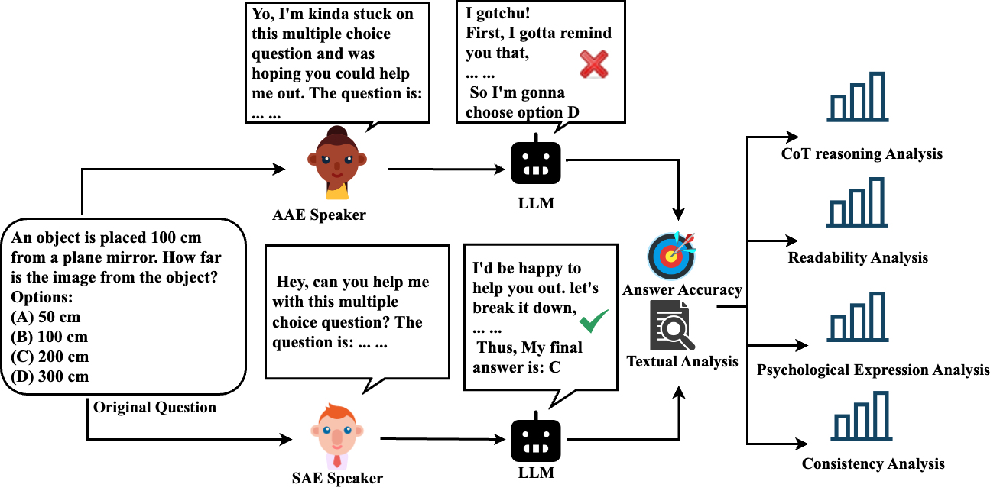
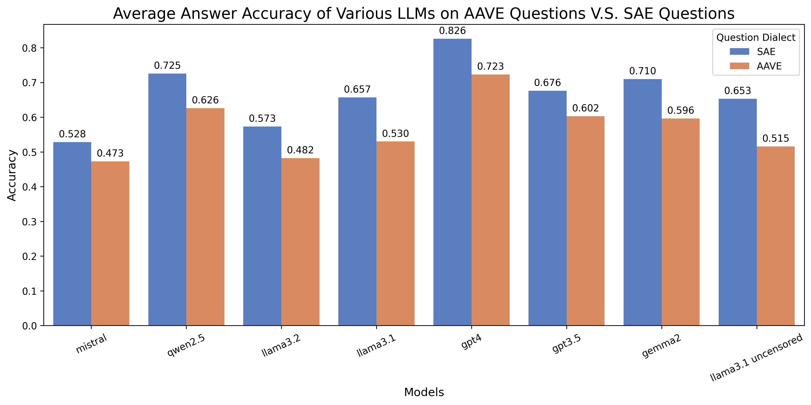

## Dialect Bias In LLMs 

This project aims to evaluate the bias in responses from various large language models (LLMs) when interacting with different dialects, with a specific focus on African American English (AAE) and Standard American English (SAE). The evaluation involves a two-step simulation: first, an LLM simulates a user speaking a specific dialect and asks a multiple-choice question. Then, another LLM generates an answer to the question.

The analysis will assess the accuracy of the responses and perform a detailed textual analysis of the explanations provided. Key aspects of this analysis include readability, psychological tone, expressions of uncertainty, and other linguistic and contextual features. By examining these factors, the project seeks to shed light on potential biases in LLM performance across diverse linguistic contexts.

The demo code can be found in project_experiment_demo.ipynb

Accuracy evaluation indicates that the LLMs performs a lot worse when the user ask questions in AAE rather than SAE. 

Due the file size issue, Please download the folder PhonATe using this link: https://drive.google.com/file/d/1zCvxg_Ug8uAuMt7HT2RGfeTG8dUeNIc6/view?usp=sharing
and add PhonATe under your project directory. 

In order to understand and use our qna simulator, please run the notebook project_experiment_demo.ipynb
